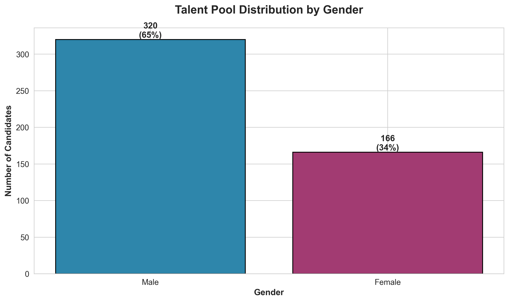
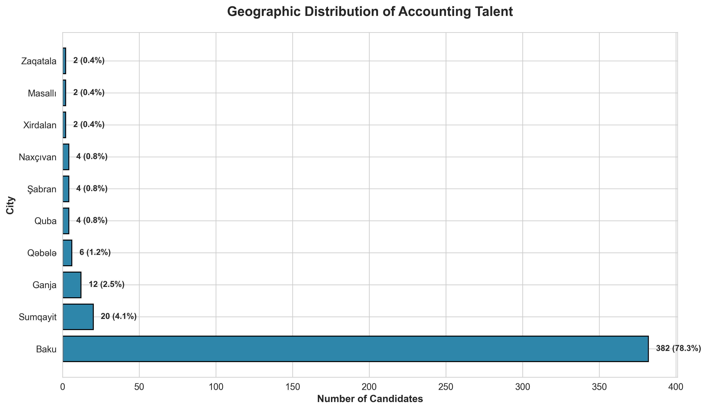
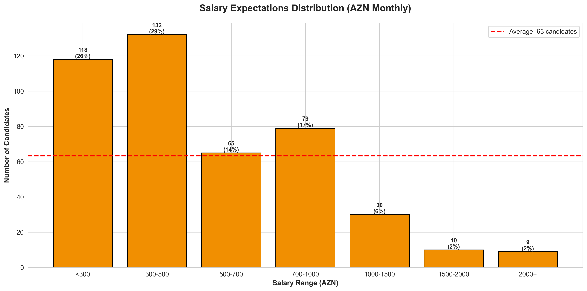
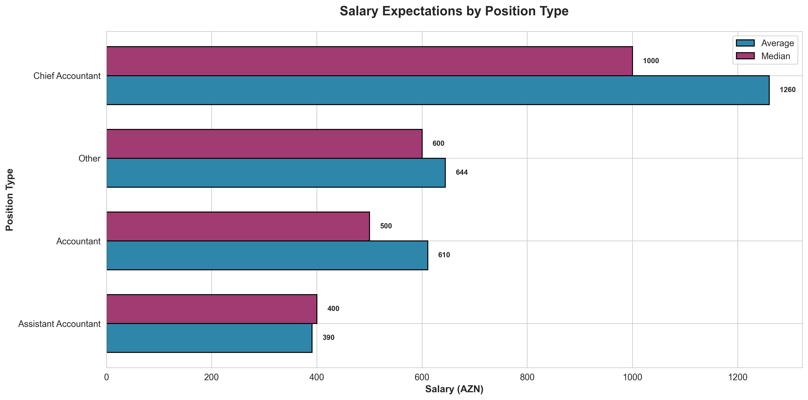
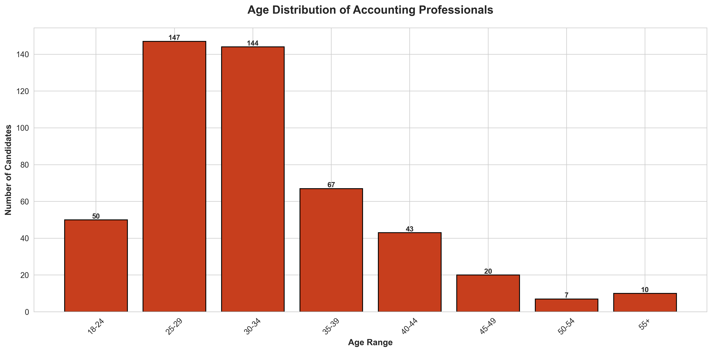
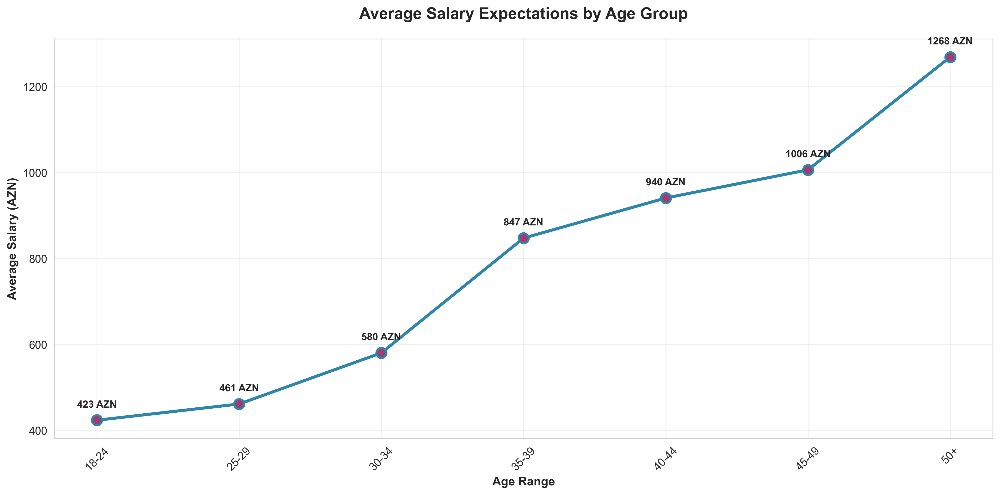
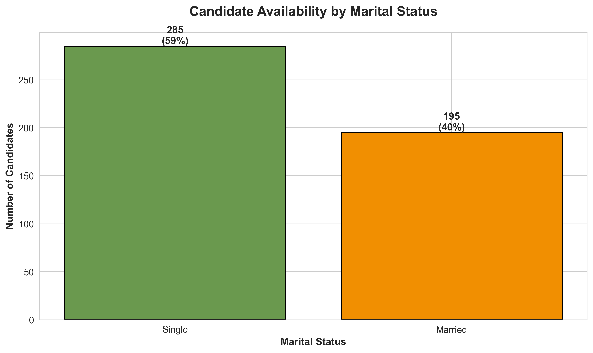
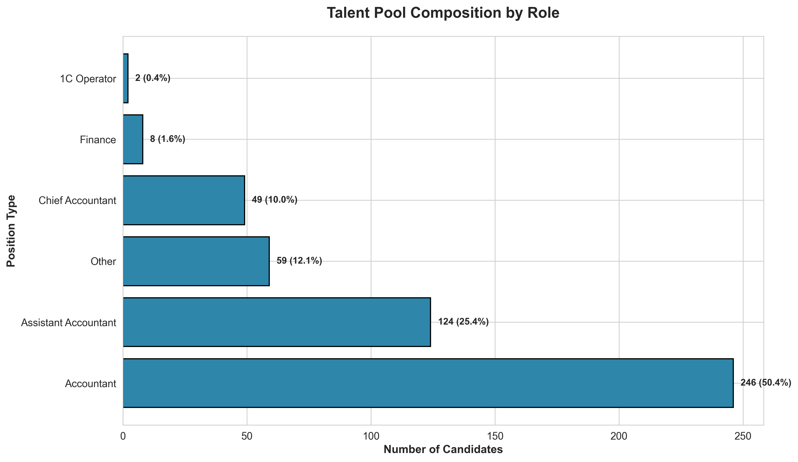

# Azerbaijan Accounting Talent Market Analysis

## Executive Summary

This analysis examines 491 accounting professionals registered on muhasib.az, Azerbaijan's leading accounting talent platform. Our findings reveal critical insights about the accounting talent market that can inform recruitment strategies, compensation planning, and workforce development initiatives.

**Key Findings:**
- The talent pool is heavily concentrated in Baku (74% of all candidates)
- Average salary expectation is 577 AZN monthly, with significant variation by role
- Male candidates outnumber female candidates 2:1 in the accounting field
- The workforce is predominantly young, with 60% under age 35
- Entry-level positions dominate the market, indicating strong junior talent availability

---

## Market Overview: Talent Pool Composition

### Finding 1: Gender Distribution Reveals Recruitment Opportunities

**What This Shows:**
The accounting profession in Azerbaijan is male-dominated, with men representing 66% of the talent pool (323 candidates) compared to 34% women (166 candidates).

**Why This Matters:**
- Diversity initiatives should focus on attracting and retaining female accounting professionals
- Organizations committed to gender balance will face recruitment challenges but can differentiate themselves as employers of choice
- Female candidates may represent an underutilized talent segment with strong potential

**Recommended Actions:**
- Implement targeted recruitment campaigns to attract female accounting professionals
- Create mentorship programs and career development pathways specifically designed for women
- Review compensation equity to ensure competitive offers for female candidates
- Partner with universities to encourage more women to pursue accounting careers

---

### Finding 2: Extreme Geographic Concentration Creates Hiring Challenges

**What This Shows:**
Baku dominates the talent market with 364 candidates (74% of total), while Sumqayit ranks second with only 15 candidates (3%). Regional markets are severely underserved.

**Why This Matters:**
- Organizations with regional offices will face significant recruitment challenges
- Baku-based companies compete for the same concentrated talent pool, driving up compensation
- Remote work policies could unlock access to the 26% of talent located outside Baku
- Regional expansion plans must account for limited local accounting talent

**Recommended Actions:**
- Consider remote work arrangements to access regional talent at potentially lower compensation levels
- Invest in relocation packages and benefits to attract Baku talent to regional offices
- Partner with regional educational institutions to develop local talent pipelines
- Explore outsourced accounting services for regional operations if local hiring proves challenging

---

## Compensation Intelligence

### Finding 3: Salary Expectations Reveal Market Segmentation

**What This Shows:**
Salary expectations cluster in three distinct bands:
- **Budget segment (under 500 AZN):** 45% of candidates - primarily entry-level positions
- **Mid-market (500-1000 AZN):** 37% of candidates - experienced accountants
- **Premium segment (1000+ AZN):** 18% of candidates - senior professionals and specialists

**Why This Matters:**
- Companies can access nearly half the talent market with budget-conscious compensation strategies
- Mid-market positions (500-1000 AZN) represent competitive hiring ground where benefits and culture matter most
- Premium talent (1000+ AZN) is scarce, representing only 18% of available professionals
- The median salary (450 AZN) is 22% lower than the mean (577 AZN), indicating a few high earners skew the average

**Recommended Actions:**
- For entry-level roles, offer 400-600 AZN to remain competitive while managing costs
- Differentiate mid-market offers (600-900 AZN) with comprehensive benefits, training, and career growth
- Prepare premium compensation packages (1200+ AZN) for senior roles, as this talent is highly sought after
- Use the median (450 AZN) rather than mean as a benchmark for junior accountant positions

---

### Finding 4: Position Type Drives Compensation Expectations

**What This Shows:**
Clear salary hierarchies exist across position types:
- **Chief Accountants:** 950-1100 AZN (highest compensation)
- **Finance roles:** 700-850 AZN
- **Accountants:** 600-700 AZN
- **Assistant Accountants:** 400-500 AZN (lowest compensation)

**Why This Matters:**
- Role clarity directly impacts compensation expectations and hiring budgets
- Organizations can save 40-50% on salary costs by hiring assistant accountants instead of full accountants
- Chief accountant positions command 2-2.5x the salary of entry-level roles
- Median salaries consistently run 10-15% below averages, suggesting negotiation room

**Recommended Actions:**
- Structure roles carefully - avoid over-titling positions that inflate salary expectations
- Consider hiring assistant accountants (400-500 AZN) for routine tasks and training them internally
- Budget 900-1100 AZN for chief accountant roles to attract qualified leadership
- Use median benchmarks for initial offers, reserving mean-level compensation for high performers

---

## Workforce Demographics and Availability

### Finding 5: Young Workforce Offers Growth Potential But Requires Development

**What This Shows:**
The talent pool skews young with distinct generational cohorts:
- **Early career (18-29):** 42% - largest segment, minimal experience
- **Prime working years (30-44):** 47% - experienced and productive
- **Senior professionals (45+):** 11% - limited availability of seasoned experts

**Why This Matters:**
- Nearly half the market consists of professionals under 30, requiring investment in training and development
- The limited supply of senior professionals (45+) will drive premium compensation for experienced leadership
- Organizations prioritizing experience will face intense competition for the 47% aged 30-44
- High availability of young talent creates opportunities for companies willing to invest in development

**Recommended Actions:**
- Build structured training programs to develop the abundant 18-29 year old talent pool
- Compete aggressively for 30-44 year old professionals through compensation and advancement opportunities
- Retain senior professionals (45+) through knowledge transfer roles, mentorship positions, and flexible arrangements
- Create apprenticeship models that combine low-cost junior talent with limited senior oversight

---

### Finding 6: Salary Expectations Rise With Age, Then Plateau

**What This Shows:**
Salary expectations follow a clear career progression pattern:
- **18-24 years:** 450 AZN (entry point)
- **25-34 years:** 550-650 AZN (rapid growth phase)
- **35-44 years:** 650-700 AZN (peak earning years)
- **45+ years:** 550-650 AZN (plateau or slight decline)

**Why This Matters:**
- The steepest salary growth occurs between ages 25-34, when professionals gain critical experience
- Compensation expectations plateau after age 35, despite continued experience accumulation
- Older professionals (45+) may accept moderate compensation in exchange for stability and work-life balance
- The 10-year experience window (25-34) is when retention becomes most expensive

**Recommended Actions:**
- Focus retention efforts on 25-34 year olds through aggressive raises and promotions to prevent turnover
- Target 45+ candidates for cost-effective hiring of experienced professionals
- Structure compensation bands that reward high performers in the 30-39 range before expectations plateau
- Offer non-monetary benefits (flexibility, reduced hours) to attract experienced 45+ professionals

---

### Finding 7: Marital Status Indicates Flexibility and Mobility

**What This Shows:**
Single professionals comprise 60% of the talent market (280 candidates), while married professionals represent 40% (191 candidates).

**Why This Matters:**
- Single professionals typically demonstrate higher geographic mobility for relocation opportunities
- Married candidates may prioritize stability, benefits, and family-friendly policies over maximum compensation
- The 60/40 split suggests strong availability of mobile talent for companies expanding regionally
- Family status influences total compensation value beyond base salary

**Recommended Actions:**
- Offer relocation packages and housing support to attract single professionals to regional positions
- Emphasize family benefits, health insurance, and work-life balance when recruiting married candidates
- Consider that single professionals may have higher turnover risk, requiring stronger retention strategies
- Structure benefits packages that appeal to both demographics rather than one-size-fits-all approaches

---

## Market Structure and Competition

### Finding 8: Entry-Level Roles Dominate Available Talent

**What This Shows:**
The talent market structure reveals:
- **Accountants (general):** 188 candidates (38%) - largest category
- **Assistant Accountants:** 145 candidates (30%) - significant entry-level supply
- **Chief Accountants:** 43 candidates (9%) - limited senior leadership
- **Specialized roles** (1C Operators, Economists): <5% each - niche talent scarcity

**Why This Matters:**
- Organizations seeking chief accountants face a limited pool of only 43 qualified candidates
- Entry-level hiring (assistants) benefits from abundant supply, creating buyer's market dynamics
- General accountant positions face the most competition, with 188 candidates sought by many employers
- Specialized skills (1C software, economics) are severely underrepresented, commanding premium compensation

**Recommended Actions:**
- Recruit chief accountants proactively and continuously, given the limited 43-candidate pool
- Leverage the abundant assistant accountant market (145 candidates) to build junior teams cost-effectively
- Differentiate general accountant roles through culture, development, and benefits to stand out among competitors
- Pay premium compensation for specialized skills or invest in training general accountants on specialized software
- Consider promoting from within for senior roles rather than competing for scarce external talent

---

### Finding 9: Gender Balance Varies Significantly by Role

**What This Shows:**
Gender representation differs dramatically across position types:
- **Chief Accountants:** 75% male (32) vs 25% female (11) - significant imbalance at leadership level
- **General Accountants:** 64% male (120) vs 36% female (68) - moderate male dominance
- **Assistant Accountants:** 68% male (99) vs 32% female (46) - entry level mirrors overall market
- **Finance roles:** 70% male dominance - highest disparity

**Why This Matters:**
- Women are significantly underrepresented in leadership positions, suggesting a "glass ceiling" effect
- The gender gap persists from entry level through executive roles, indicating systematic barriers
- Organizations committed to diversity face limited female candidates at all levels
- Finance leadership roles show the most extreme gender imbalance, presenting DEI challenges

**Recommended Actions:**
- Implement targeted programs to develop and promote female accountants into chief accountant roles
- Set diversity hiring goals with recognition that female candidates represent only 25-36% of each talent pool
- Create sponsorship and advancement programs specifically for high-potential female accountants
- Audit promotion and compensation practices to identify and eliminate gender-based barriers
- Partner with professional associations to increase female participation in accounting professions

---

## Strategic Recommendations

### Talent Acquisition Strategy

**For Organizations Hiring at Scale:**
1. Focus recruitment on the abundant entry-level market (45% of candidates expect under 500 AZN)
2. Build structured development programs to convert junior talent into experienced professionals
3. Establish presence in Baku where 74% of talent resides, or embrace remote work
4. Budget 400-600 AZN for assistant accountants, 700-900 AZN for accountants

**For Organizations Seeking Experienced Leadership:**
1. Compete aggressively for the limited pool of 43 chief accountants
2. Offer 1000-1200 AZN compensation plus comprehensive benefits
3. Target professionals aged 35-44 for optimal experience-to-cost ratio
4. Consider promoting internal talent rather than competing for scarce external candidates

### Compensation Planning

**Benchmarking Guidelines:**
- **Entry Level (Assistant Accountants):** 400-500 AZN
- **Mid-Career (Accountants):** 600-800 AZN
- **Senior (Chief Accountants):** 900-1200 AZN
- **Specialized Roles:** 800-1000 AZN minimum

**Cost Optimization Approaches:**
- Hire younger professionals (25-29) before salary expectations peak at age 30-34
- Consider regional candidates willing to relocate for Baku compensation levels
- Structure career ladders that delay title progression to manage compensation inflation
- Use median rather than mean salaries as offer baselines

### Diversity and Inclusion Initiatives

**Priority Actions:**
1. Set female hiring targets of 40-50% to exceed current 34% market representation
2. Create female-specific development programs for progression to chief accountant roles
3. Audit compensation equity - ensure female professionals receive equal pay for equal roles
4. Sponsor women in accounting through university partnerships and scholarship programs

### Geographic Expansion Considerations

**Regional Operations:**
- Accept higher recruiting costs or relocation packages to staff regional offices
- Develop remote work policies to access the 26% non-Baku talent pool
- Partner with local educational institutions to create future talent pipelines
- Consider outsourced services for accounting functions in underserved regions

**Baku Operations:**
- Prepare for intense competition for the concentrated 74% of talent in the capital
- Differentiate through culture, development opportunities, and comprehensive benefits
- Leverage networking and referrals in the tight-knit Baku accounting community
- Invest in employer branding to stand out in a crowded market

---

## Conclusion

The Azerbaijan accounting talent market presents both opportunities and challenges for employers. The abundance of young, entry-level talent creates cost-effective hiring opportunities for organizations willing to invest in development. However, severe geographic concentration in Baku, limited female representation, and scarce senior leadership create competitive pressure in specific segments.

Organizations that succeed in this market will:
- Build strong employer brands that attract talent in the concentrated Baku market
- Invest in developing junior talent rather than competing solely for scarce senior professionals
- Implement diversity initiatives to tap into underrepresented female talent
- Structure compensation strategically based on position, age, and market benchmarks
- Consider remote work policies to access talent outside the Baku concentration

The data suggests a market in transition, with young professionals entering the field in significant numbers. Forward-thinking organizations can build sustainable competitive advantages by capturing, developing, and retaining this emerging talent before compensation expectations rise with age and experience.

---

## Data Methodology

**Dataset:** 491 accounting professional profiles from muhasib.az
**Analysis Period:** Current active profiles
**Geographic Scope:** Azerbaijan nationwide
**Salary Currency:** AZN (Azerbaijani Manat) monthly gross

All visualizations exclude statistical outliers and focus on actionable business segments. Salary data represents candidate expectations rather than actual compensation paid. Geographic data standardized to consolidate variations in city name spellings (Baku/Bakı/Baki).
